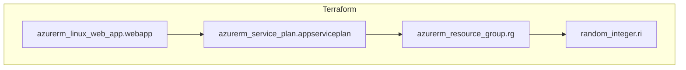
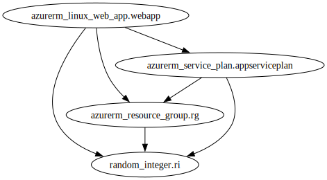

infracost breakdown --path .

terraform apply -auto-approve

dotnet aspnet-codegenerator Controller -name UrlMappingController -m UrlMapping -dc ShortContext -outDir Controllers -udl

az webapp deployment list-publishing-profiles --name upt-awa-113 --resource-group upt-arg-113 --xml

zip -r deploy.zip .

az webapp deploy --resource-group upt-arg-113 --name upt-awa-113 --src-path deploy.zip --clean true --restart true --debug

az monitor metrics list --resource "/subscriptions/1f57de72-50fd-4271-8ab9-3fc129f02bc0/resourceGroups/UPT/providers/Microsoft.Web/sites/appblazor0001" --metric "Requests" --start-time 2025-01-07T18:00:00Z --end-time 2025-01-07T23:00:00Z --output table

inframap_azure.svg

```mermaid
architecture-beta
    group api(logos:aws-lambda)[API]

    service db(logos:aws-aurora)[Database] in api
    service disk1(logos:aws-glacier)[Storage] in api
    service disk2(logos:aws-s3)[Storage] in api
    service server(logos:aws-ec2)[Server] in api

    db:L -- R:server
    disk1:T -- B:server
    disk2:T -- B:db
```

graph TD;
    A-->B;
    A-->C;

<!-- Add this anywhere in your Markdown file -->

